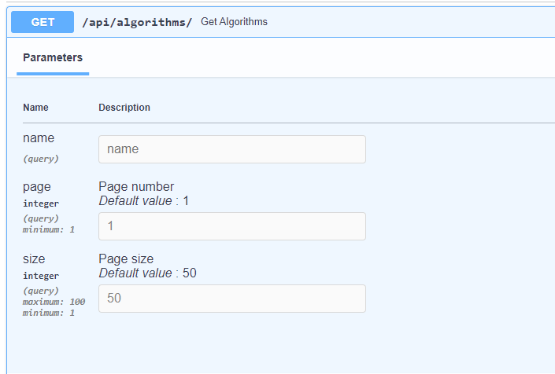
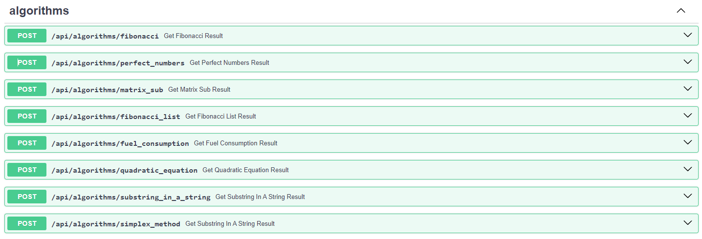

# algoscalc-back

## Репозиторий с исходным кодом для серверной части онлайн-калькулятора.

Проект по разработке и поддержке онлайн-калькулятора предназначен для проведения практических занятий со студентами.
Ресурсы серверной части онлайн-калькулятора:

- [Тестовый контур](https://test.ommat.ru/api/algorithms) серверной части онлайн-калькулятора.
- [Документация API](https://swagger.ommat.ru/docs) серверной части онлайн-калькулятора.
- [Документация исходного кода](https://backend-docs.ommat.ru/index.html) серверной части онлайн-калькулятора.
- [Продуктовый контур](https://prod.ommat.ru/api/Test) серверной части онлайн-калькулятора.

## Запуск Backend'а

Для начала работы всего бекенда необходимо скачать репозиторий и перейти в него,
далее выполнить команду `docker-compose up --build`.

После, необходимо открыть проект в новом терминале и ввести команду
`docker-compose exec -it backend_test sh -c "alembic upgrade head"`,
в результате выполнения данной команды будут созданы таблицы в базе данных.

На данном этапе мы можем обращаться к API по адресу http://127.0.0.1:4445/ ,
но никакой информации о алгоримтах мы не получим, так как таблицы ещё не заполнены.

Для заполнения таблиц нужно выполнить
команду ` docker-compose exec -it  postgres_db  sh -c "psql -U postgres -d algocalc_db -a -f init.sql"`.
Теперь, перейдя по адресу http://127.0.0.1:4445/admin/ , мы увидим заполненные таблицы БД,
а по адресу http://127.0.0.1:4445/docs нам будет доступен список всех взаимодействий с API.

## Список изменений

### Хранение данных в БД

В файле `docker-compose.yml` был добавлен сервис `postgres_db` по образу БД PostgreSQL 15.
Сервис бекенда ожидает полного запуска БД и только после этого сам начинает старт.

### Пагинация и Фильтрация

Для постраничного вывода всех алгоритмов было добавлено два параметра: page и size.
Для реализации фильтрации добавлен параметр name, который по переданной строке будет искать похожие имена алгоритмов.
Все параметры являются необязательными и имеют предустановленные значения.

### Доработка API

В файле `src/errors.py` расположен Enum-список обрабатываемых ошибок, которые передаются пользователю на вывод.
Обработка ошибок производится менеджером алгоритмов в файле `src/algorithms_manager.py`

### Валидация параметров

Валидация входных параметров происходит автоматически, за счёт разделения получения результата алгоритма на отдельные
роутеры .

### Симплекс метод

Был реализован алгоритм сиплекс-метод, добавлен в менеджер алгоритмов, входные параметры валидируются, выходные тоже, 
добавлена обработка исключений, алгоритм занесён в БД (в общем всё как и для остальных алгоритмов)